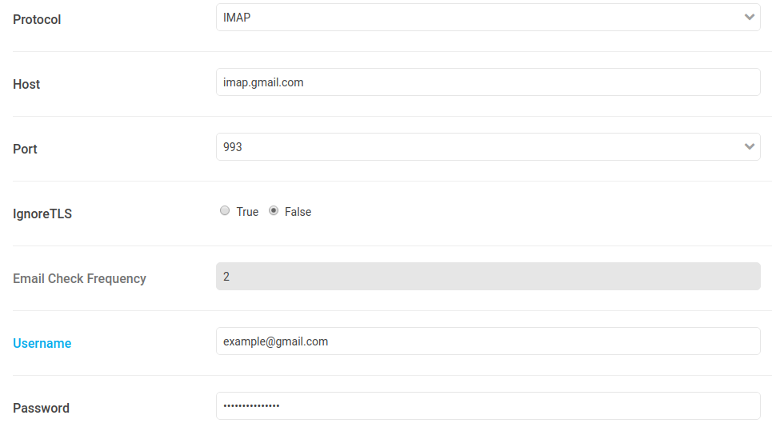

# Direct Email reply

## Introduction

Enable this feature to allow users to reply to chat messages by directly replying to email notifications they receive. We currently use [subaddressing](https://en.wikipedia.org/wiki/Email_address#Subaddressing) for this feature.

## Set up credentials

Go to `Administration settings > Email > Direct reply`.

After that:

* select the email server protocol \(`IMAP` or `POP`\)
* your email server host name \(e.g. `imap.example.com` or `pop.example.com`\)
* the port \(143 or 993 for IMAP and 110 or 995 for POP\)
* ignore TLS `true` if port 143 or 110
* email check frequency \(in minutes\) if POP server \(&gt;=2\)
* delete intercepted emails. We recommend to select/keep `true` if you don't want to keep copy of email messages, in case IMAP server.
* a separator \(default and recommended\) is the character separating base and tag part of the email. E.g.: `base+tag@domain` \(separator: +\). [More info here](https://en.wikipedia.org/wiki/Email_address#Subaddressing)
* your credentials \(Username & password\)

  Once filled, click **Save changes**.

## Example settings

### IMAP settings



### POP3 settings

Make sure your **POP3** server keeps keep **no** copy of emails, otherwise it is treated as a new message every time.


Now, you can reply chat messages via email. It supports full formatting like inline, multiline, bold, italics etc.

### Switch from IMAP to POP

* Before you switch from IMAP to POP over the same email address, you must empty all the folders. Keeping all emails results in duplicate messages, because all those messages in POP are treated as new messages.

## Note

* Currently, only emails in English are supported, or at least the quote `On <date>, <author> wrote:` is in English.

An Email body in languages other than English may also work until and unless `On <date>, <author> wrote:` is in English or a copy of older email is removed manually.

* Only text messages are supported; attachments are not supported yet.

## Known issues

### Quoted headers

Quoted headers aren't picked up if the email client breaks it up into multiple lines.

GMail breaks up any lines over 80 characters for you.

```text
On <date>, <author>
wrote:
> blah
```

Not to mention that we are searching for `on` and `wrote`. It doesn't work with other languages.

**Possible solution**: while replying, remove everything else than your actual message.

### Weird signatures

Lines starting with `-` or `_` sometimes mark the beginning of signatures:

```text
Hello

--
Rick
```

But some users change this convention:

```text
Hello

Mr Rick Olson
Galactic President Superstar Mc Awesomeville
GitHub

**********************DISCLAIMER***********************************
* Note: blah blah blah                                            *
**********************DISCLAIMER***********************************
```

## Problem?

Your message wasn't posted? Did you get an `Invalid Email` in the `Admin` console? This most likely means that the email format was not as expected. Maybe you were blocked or the message/room was deleted.

